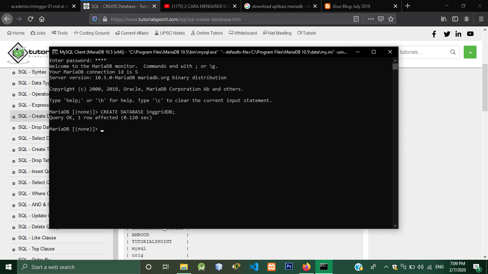

# tekn-basis-data
# latihan2
1. create database 
Membuat database dengan nama inggridDB

2. SHOW DATABASES
Menampilkan database
(db2.png)
3. CREATE TABLE
```CREATE TABLE pelanggan (
   id VARCHAR (2) NOT NULL,
   nama VARCHAR (30) NOT NULL,
   alamat VARCHAR (30) NOT NULL,
   bagian VARCHAR (2) NOT NULL,
   PRIMARY KEY (id));```
   Membuat tabel pelanggan 
   (db3.png)
4. desc.
   menampilkan isi tabel
   (db4.png)
5. ```CREATE TABLE movies (
    -> movies VARCHAR (30) NOT NULL PRIMARY KEY,
    -> id VARCHAR (2) NOT NULL,
    -> FOREIGN KEY (id) REFERENCES pelanggan (id));
    (db5.png)```
6. desc movies.
menampilkan isi tabel movie
(db6.png)
7.	Insert query.
menambah data kedalam tabel
(db7.png)
8.SELECT.
Menggunakan perintah Select tabel
Memilih kolom dari tabel yang ingin ditampilkan
(db8.png)
9.Menampilkan id, nama dari tabel pelanggan dan movies dari movies.
(db9.png)

