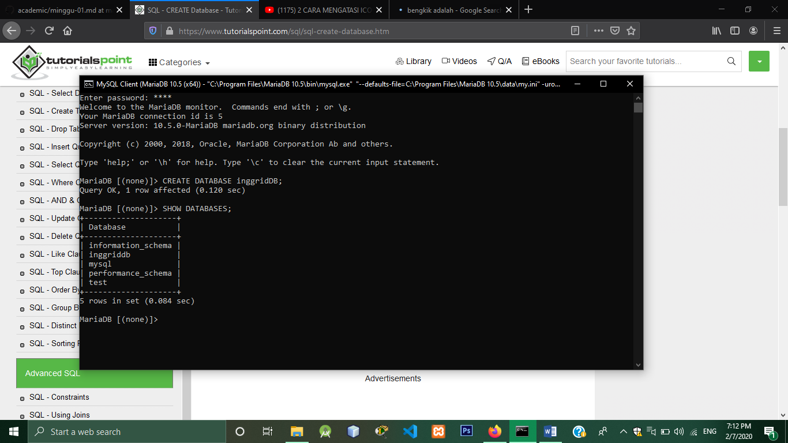
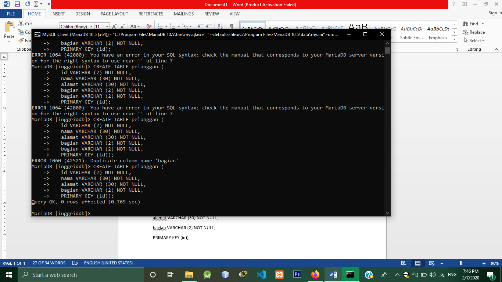
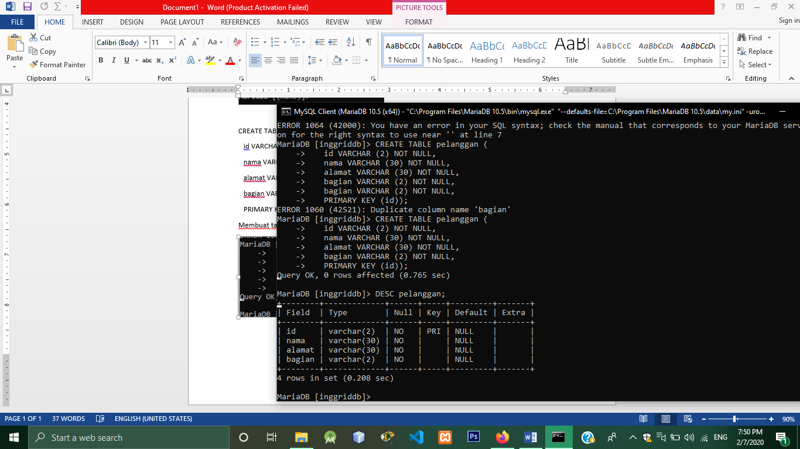
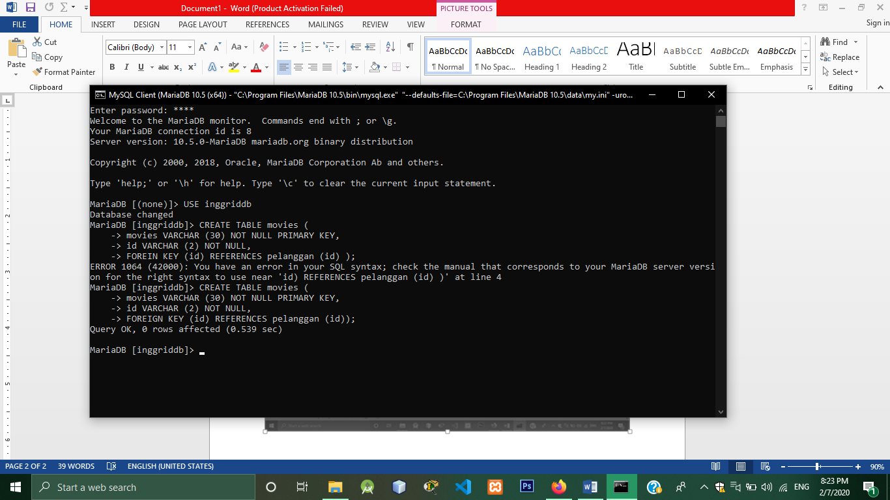
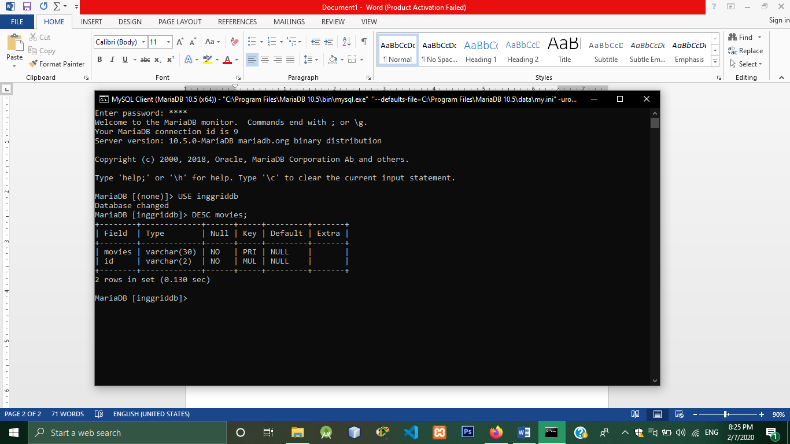
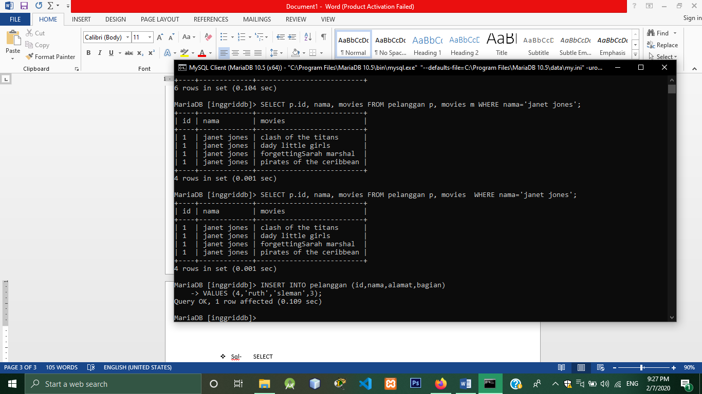
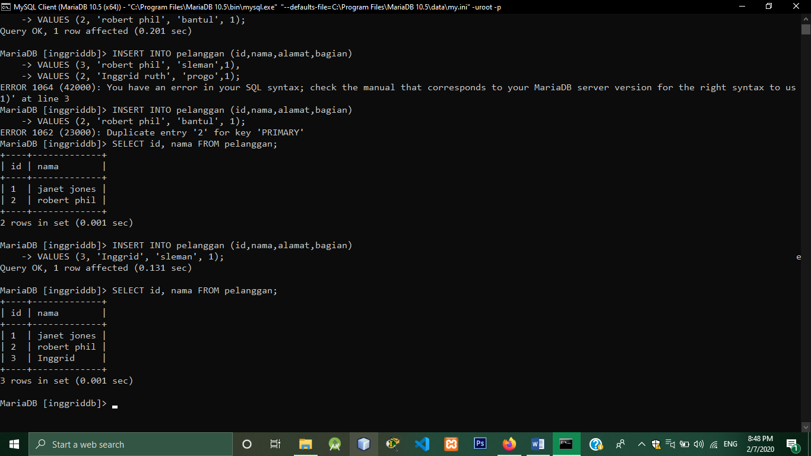
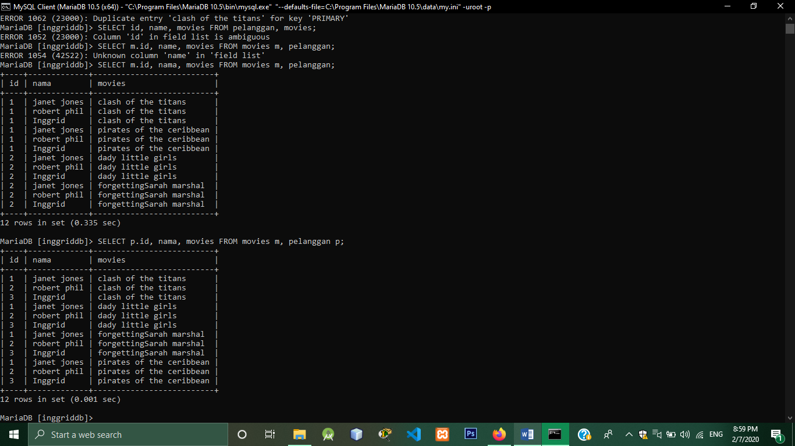

# tekn-basis-data
# latihan2
### create database.
Membuat database dengan nama inggridDB, pada tampilan dibawah ini terlihat bahwa database yang dibuat berhasil

### SHOW DATABASES.
Menampilkan database

### CREATE TABLE.
 
### DESC.
menampilkan isi tabel
 
### create tabel movie
membuat tabel movie.
   
### desc movies.
menampilkan isi tabel movie

### Insert query.
menambah data kedalam tabel

### SELECT.
Menggunakan perintah Select tabel
Memilih kolom dari tabel yang ingin ditampilkan

Menampilkan id, nama dari tabel pelanggan dan movies dari movies.

