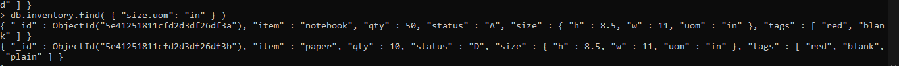
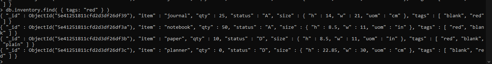
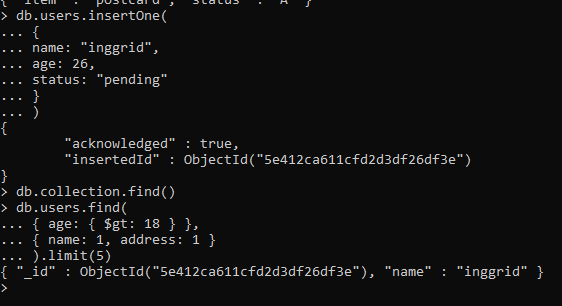

# latihan 3
1. switch database
Perintah dibawah ini artinya membuat database baru dengan perintah awal db, use examples artinya database yang akan digunakan adalah exampes 

2. populate collection (insert)
Berikut adalah membuat koleksi dengan perintah db.inventory.insertmany yang artinya nama koleksi adalah inventory dan data yang disimpan lebih dari satu sehingga menggunakan perintah insertmany.

3. sellect all documents
Perintah dibawah ini artinya menampilkan isi koleksi/data yang ada dalam inventory.

Terdapat perintah pretty () yang digunakan untuk merapikan data atau koleksi yang ingin ditampilkan

4.Specify equality matches
db.inventory.find (syarat tertentu) perintah ini digunakan untuk menampilkan data dengan ketentuan tertentu sesuai syarat atau perintah di dalam kurung tersebut
db.inventory.find( { status: "D" } );
perintah ini artinya menampilkan data/koleksi pada inventory yang statusnya “D”, sama halnya dengan perintah di bawah ini.

db.inventory.find( { qty: 0 } );

db.inventory.find( { qty: 0, status: "D" } );

db.inventory.find( { "size.uom": "in" } )

db.inventory.find( { size: { h: 14, w: 21, uom: "cm" } } )

db.inventory.find( { tags: "red" } )

db.inventory.find( { tags: [ "red", "blank" ] } )

5. Specify fields to return
Perintah ini akan menampilkan data dengan lebih spesifik.
db.inventory.find( { }, { item: 1, status: 1 } );

db.inventory.find( {}, { _id: 0, item: 1, status: 1 } );

# latihan 4
perintah ini artinya membuat koleksi yang nanti disimpan ke dalam users, hanya terdapat 1 koleksi sehingga menggunakan insertone

perintah dibawah ini untuk menampilkan atau menemukan koleksi yang ada

berikut adalah mengupdate koleksi dengan kata kunci age ($gt:18 ) untuk menentukan kolkesi yang mau diubah dengan umur lebih dari 18, sedangkan set pada status adalah data yang akan diubah.

perintah tersebut untuk menghapus data/ koleksi.

