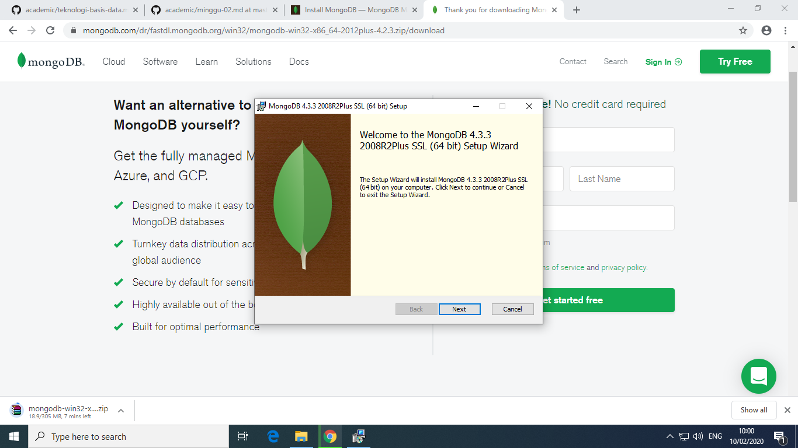
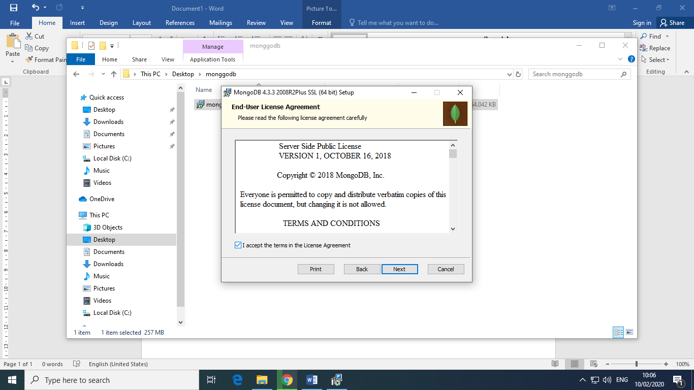
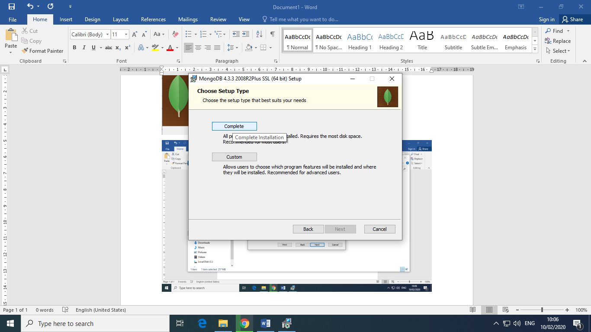
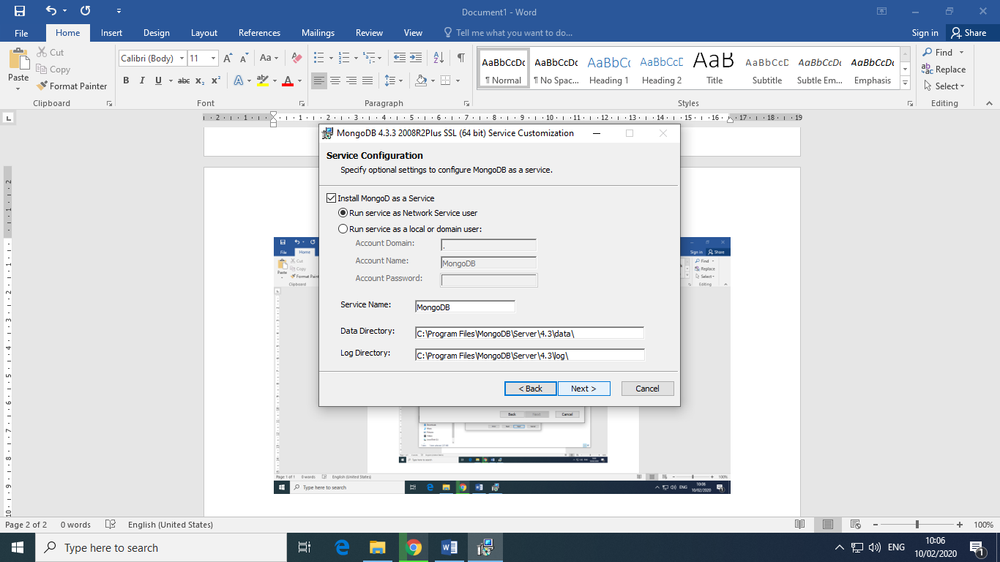
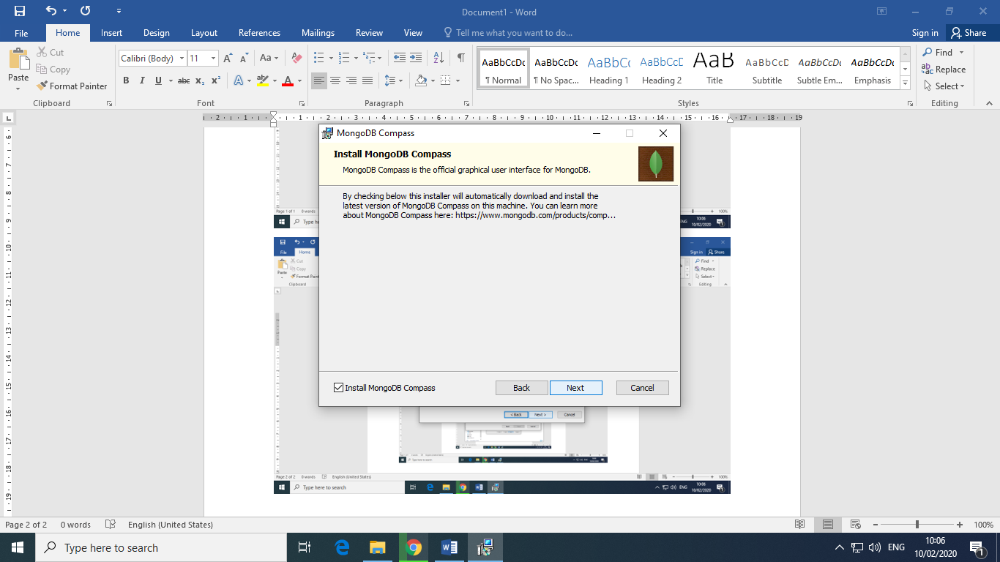
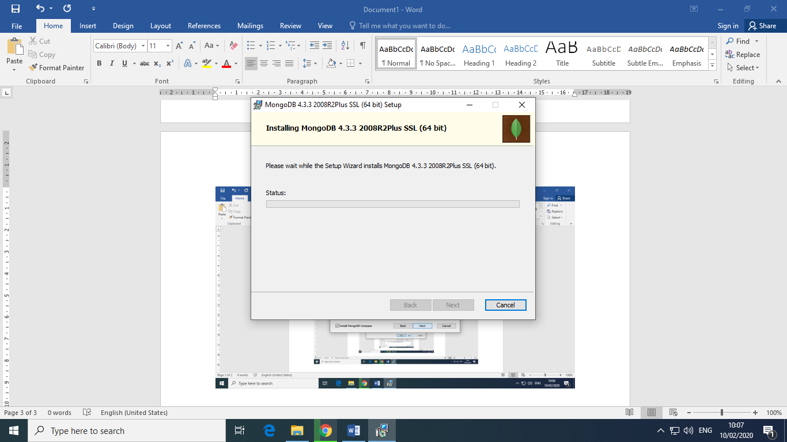
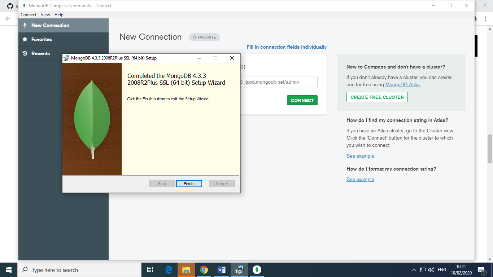

# tekn-basis-data
# cara menginstal mongoDB
Cara menginstal mongoDB adalah buka aplikasi mongodb yang sudah didownload, tampilan awal akan seperti dibawah ini lalu klik next.

Kemudian pada tampilan berikut klik ceklis pada kotak “I accept the terms in the license agreement” lalu klik next untuk melanjutkan

Pada tampilan setup type pilih yang complete lalu next

Pada tampilan service configuration klik next

Setelah muncul tampilan installing, tinggal menunggu hingga selesai lalu klik finish

