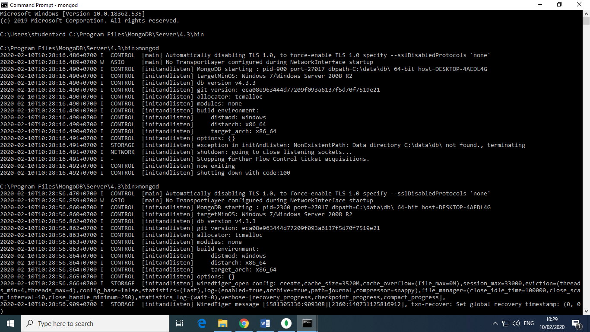
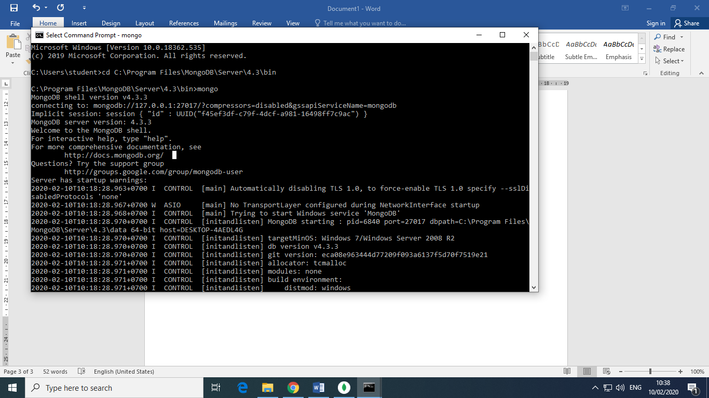

# tekn-basis-data
# cara menjalankan mongo shell
Cara menjalankan shall pada mongodb adalah
buka cmd dan tuliskan perintah  cd <spasi> copy link mongodb lalu enter
Lalu tuliskan perintah “mongod” kemudian buat folder baru dengan nama “data” dan didalamnya terdapat  folder dengan nama “db” yang letaknya di partisi c

Kemudian buka cmd tab baru lalu tuliskan perintah  cd <spasi> copy link mongodb lalu enter
Setelah itu tuliskan perintah “mongo” maka tampilan akan seperti dibawah ini.
.
