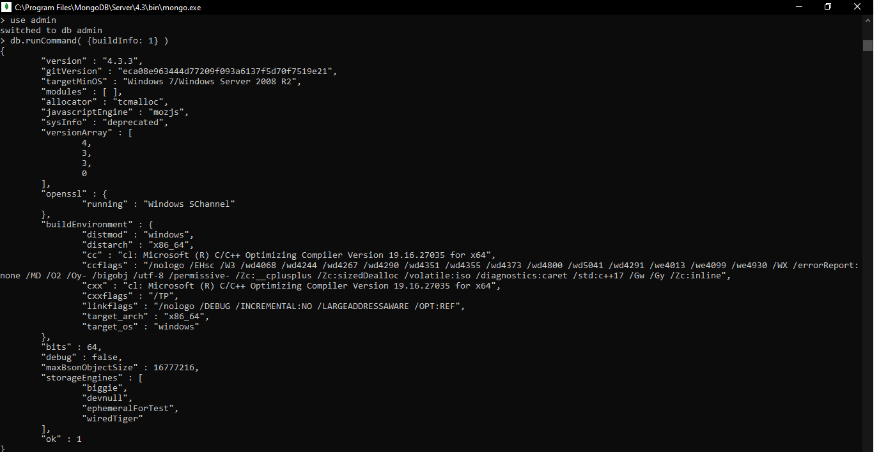
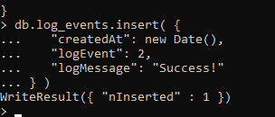

# tekn-basis-data
# tugas
Basic operation
use databases commends
 Database Command Form

Issue Commands

Admin Database Commands

db.adminCommand( {buildInfo: 1} )

Expire Data from Collections by Setting TTl
Create index

insert

Create index

Insert 

Database Profiler
Enable and Configure Database Profiling

Specify the Threshold for Slow Operations

Profile a Random Sample of Slow Operations

Check Profiling Level

Disable Profiling

