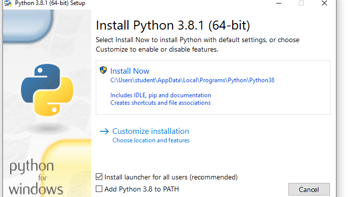
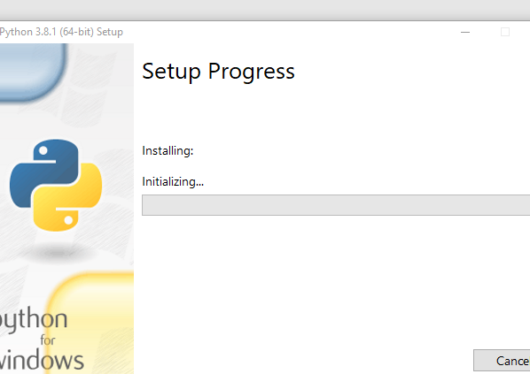
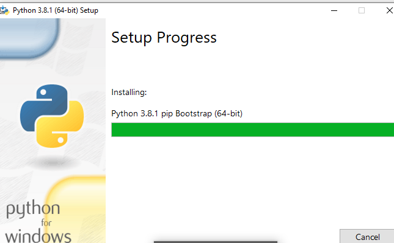
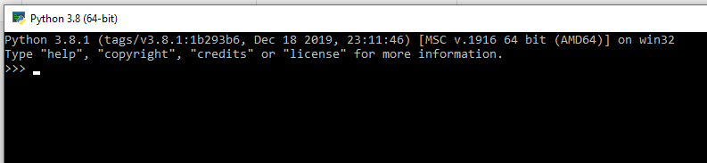

# tekn-basis-data
# latihan 2
Cara menginstal python 
Langkah pertama adalah centang pada kotak dibawah lalu klik instal now 

kemudian akan muncul setup progress lalu tunggu sampai instalasi selesai

Maka tampilan akan muncul seperti ini.

