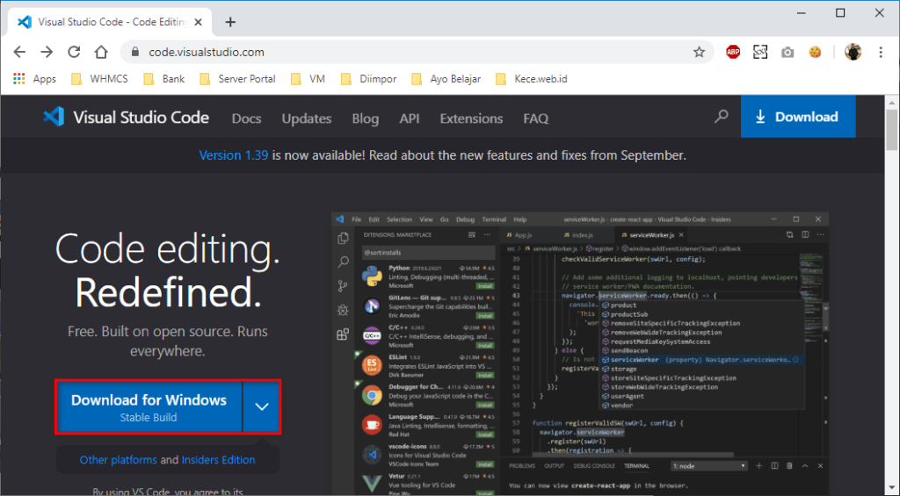
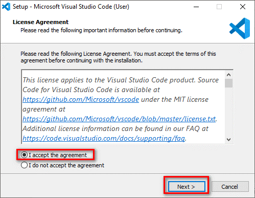
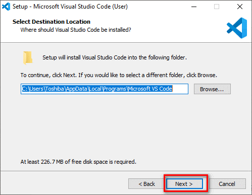
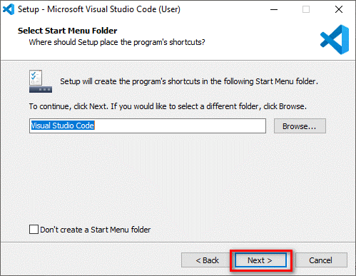
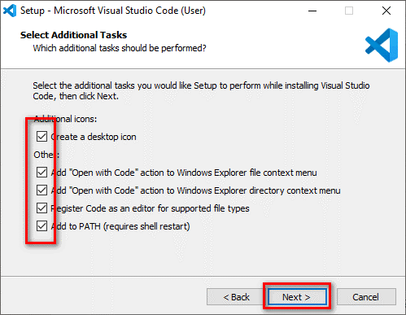
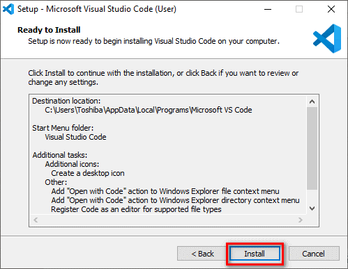
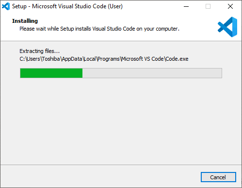
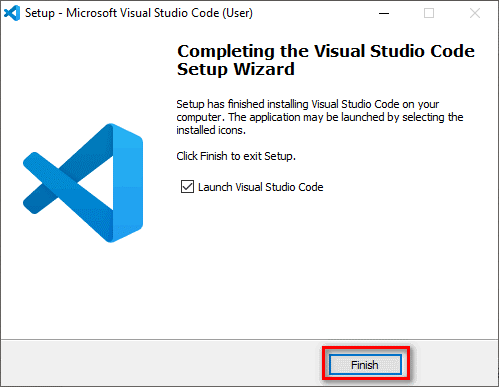
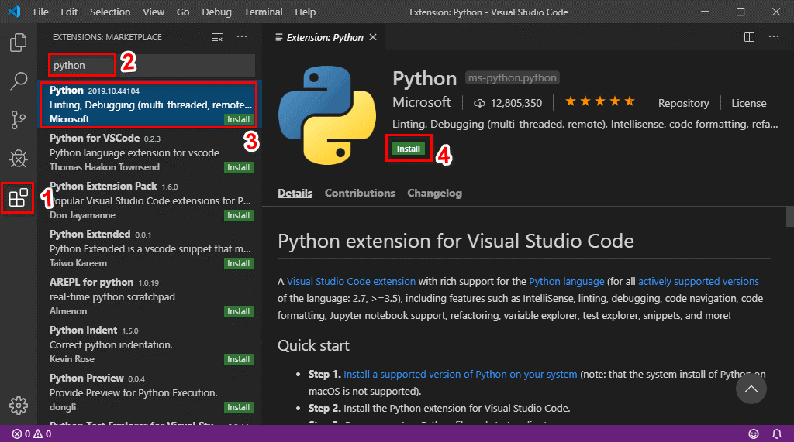
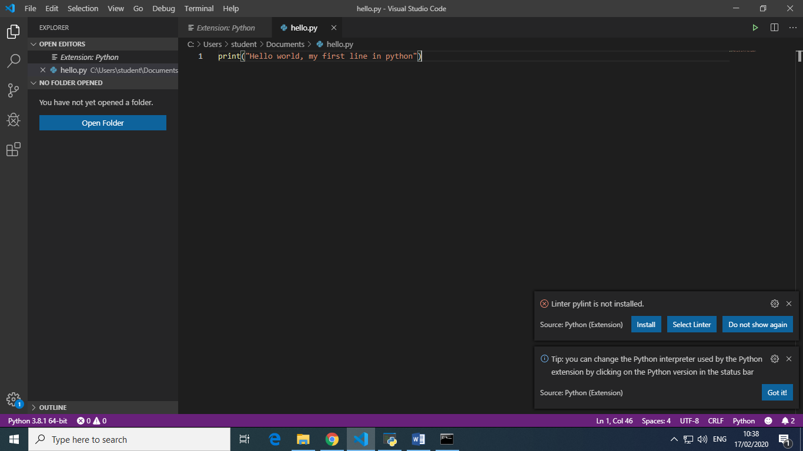

# tekn-basis-data
# latihan 3
Tutorial Install Visual Studio Code
Pertama download aplikasi vs code

Setelah berhasil di download, buka aplikasinya lalu akan muncul tampilan seperti dibawah ini dan Pilih “I accept the aggrement” untuk menyetujui “License Agreement”, kemudian klik Next.

Pada tampilan Select Destination Location adalah tempat penyimpanan instalasi aplikasi tersebut, kemudian klik next 

Klik Next lagi jika tidak akan merubah Start Menu Folder.

Pada tampilan Select Additional Tasks centang semua. Kemudian Next.

Lalu klik Install untuk memulai proses installasi. 

Tunggu sampai proses installasi selesai.

Setelah selesai klik Finish.

# Install Extensions
Setelah selesai di install, buka aplikasinya dan pilih menu extensions, kemudian isikan “python” pada kotak pencarian (terhubung jaringan wifi) setelah muncul tampilan seperti dibawah ini klik pada python dan pilih instal tunggu sampai instalasi selesai

Setelah selesai buatlah document baru dengan format ‘py’ lalu simpan.

