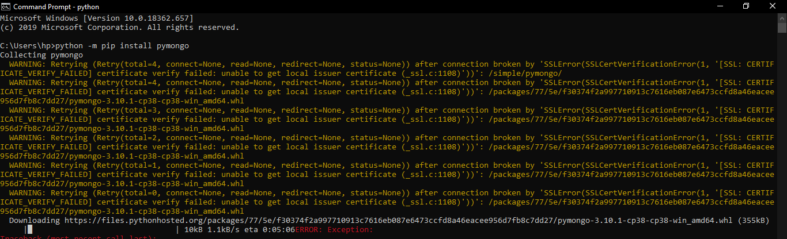
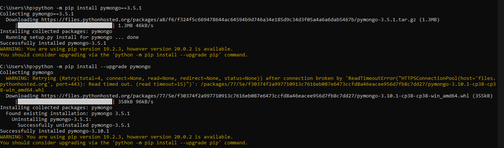
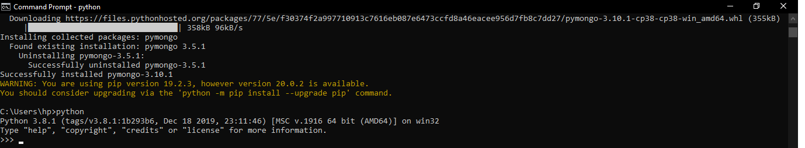

# tekn-basis-data
Instalasi pymongo
Cara menginstal pip 
$ python -m pip install pymongo

Untuk mendapatkan spesifikasi dari  pymongo:
Tuliskan perintah di bawah ini
$ python -m pip install pymongo==3.5.1

Untuk mengupgrade pip:
$ python -m pip install --upgrade pymongo

