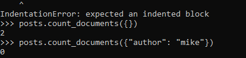

# tekn-basis-data
# latihan 5
# Tutorial
Tutorial ini dimaksudkan sebagai pengantar untuk bekerja dengan MongoDB dan PyMongo.
# Prerequisites
>>> import pymongo
Sebelum mengimport, pymongo harus sudah diinstal

Making a Connection with MongoClient
Perintah dibawah ini untuk membuat koneksi antara mongoClient dan pymongo dan juga membuatnya terhubung pada host default dan Port

# Getting a Database
Disini akan menggunakan database dengan pymongo

# Getting a Collection
Sebuah koleksi adalah sekelompok dokumen yang disimpan dalam MongoDB, dan dapat dianggap sebagai sekitar setara dengan tabel dalam database relasional. Mendapatkan koleksi di PyMongo bekerja sama dengan mendapatkan database:

> > > Koleksi = DB. test_collection
Catatan penting tentang koleksi (dan database) di MongoDB adalah bahwa mereka diciptakan malas-tak satu pun dari perintah di atas telah sebenarnya dilakukan setiap operasi pada server MongoDB. Koleksi dan database dibuat saat dokumen pertama dimasukkan ke dalamnya.
# Document
Data dalam MongoDB diwakili (dan disimpan) menggunakan dokumen bergaya JSON. Dalam PyMongo  menggunakan Kamus untuk mewakili dokumen. untuk mewakili sebuah posting blog:

> > > Impor datetime
> > > Post = { "Author ":  "Mike ",
...  "text ":  "posting blog pertama saya! ",
...  "Tags ": [ "mongodb ",  "Python ",  "pymongo "],
...  "tanggal ": datetime. datetime. utcnow ()}
Perhatikan bahwa dokumen dapat berisi jenis Python asli (seperti contoh datetime. datetime) yang akan secara otomatis dikonversi ke dan dari jenis BSON yang sesuai.

# Inserting document
Untuk memasukkan dokumen ke dalam koleksi kita dapat menggunakan metode insert_one ():

> > > Posts = DB. Posts
> > > post_id = Posts. insert_one (post). inserted_id
> > > post_id
ObjectId ('... ')
Secara otomatis diberi kode khusus untuk onjek tersebut.
Ketika dokumen disisipkan kunci khusus,  "_id ", secara otomatis ditambahkan jika dokumen belum berisi kunci  "_id ". Nilai  "_id " harus unik di seluruh koleksi. insert_one () mengembalikan sebuah instance dari InsertOneResult. Untuk informasi lebih lanjut tentang  "_id ", lihat dokumentasi di _id.
Setelah memasukkan dokumen pertama, koleksi posting sebenarnya telah dibuat di server. Kita dapat memverifikasi ini dengan mencantumkan semua koleksi dalam database kita:
> > > DB. list_collection_names ()
[u'posts ']
# Getting a Single Document With find_one()
Jenis paling dasar dari query yang dapat dilakukan di MongoDB adalah find_one (). Metode ini mengembalikan satu dokumen yang cocok dengan query (atau none jika tidak ada kecocokan). Hal ini berguna ketika Anda tahu hanya ada satu dokumen yang cocok, atau hanya tertarik pada pertandingan pertama. Di sini kita menggunakan find_one () untuk mendapatkan dokumen pertama dari koleksi posting:

> > > Impor pprint
> > > pprint. pprint (Posts. find_one ())
{u ' _id ': ObjectId ('... '),
 u'author ': u'Mike ',
 u'date ': datetime. datetime (...),
 u'tags ': [u'mongodb ', u'python ', u'pymongo '],
 u'text ': u'My posting blog pertama! '}

Hasilnya adalah yang cocok dengan yang kita masukkan sebelumnya.
Catatan
Dokumen yang dikembalikan berisi  "_id ", yang secara otomatis ditambahkan pada insert.
find_one () juga mendukung kueri pada elemen tertentu yang harus cocok dengan dokumen yang dihasilkan. Untuk membatasi hasil kami ke dokumen dengan penulis "Mike" kita lakukan:

> > > pprint. pprint (Posts. find_one ({ "Pengarang ":  "Mike "}))
{u ' _id ': ObjectId ('... '),
 u'author ': u'Mike ',
 u'date ': datetime. datetime (...),
 u'tags ': [u'mongodb ', u'python ', u'pymongo '],
 u'text ': u'My posting blog pertama! '}

Jika kita mencoba dengan pengarang yang berbeda, seperti "Eliot", kita tidak akan mendapatkan hasil:

> > > Posts. find_one ({ "Author ":  "Eliot "})

# Querying By ObjectId
Kita juga dapat menemukan posting dengan _id, yang dalam contoh kita adalah ObjectId:

> > > post_id
ObjectId (...)
> > > pprint. pprint (Posts. find_one ({ "_id ": post_id}))
{u ' _id ': ObjectId ('... '),
 u'author ': u'Mike ',
 u'date ': datetime. datetime (...),
 u'tags ': [u'mongodb ', u'python ', u'pymongo '],
 u'text ': u'My posting blog pertama! '}

Perhatikan bahwa ObjectId tidak sama dengan representasi string:

> > > post_id_as_str = Str (post_id)
> > > Posts. find_one ({ "_id ": post_id_as_str}) # tidak ada hasil
>>>
Tugas umum di aplikasi web adalah untuk mendapatkan ObjectId dari URL permintaan dan menemukan dokumen yang cocok. Hal ini diperlukan dalam kasus ini untuk mengkonversi ObjectId dari string sebelum lewat ke find_one:
dari bson. ObjectID impor ObjectId
# Bulk Inserts
Dalam rangka untuk membuat query sedikit lebih menarik, Selain memasukkan satu dokumen, kita juga dapat melakukan operasi insert massal, dengan melewatkan daftar sebagai argumen pertama yang insert_many (). Ini akan memasukkan setiap dokumen dalam daftar, mengirim hanya satu perintah ke server:

> > > new_posts = [{ "Author ":  "Mike ",
...  "text ":  "posting lain! ",
...  "Tags ": [ "Bulk ",  "insert "],
...  "date ": datetime. datetime (2009, 11, 12, 11, 14)},
...              { "Author ":  "Eliot ",
...  "title ":  "MongoDB is fun ",
...  "text ":  "and pretty easy too! ",
...  "date ": datetime. datetime (2009, 11, 10, 10, 45)}]
> > > Result = Posts. insert_many (new_posts)
hasil > > >. inserted_ids
[ObjectId ('... '), ObjectId ('... ')]

Ada beberapa hal menarik untuk dicatat tentang contoh ini:
Hasil dari insert_many () sekarang mengembalikan dua instance ObjectId, satu untuk setiap dokumen yang disisipkan.
        new_posts [1] memiliki "bentuk" yang berbeda dari yang lain posting-tidak ada  "Tags " lapangan dan kami telah menambahkan bidang baru,  "title ". Ini adalah apa yang kita maksudkan ketika kita mengatakan bahwa MongoDB adalah skema-bebas.
# Querying for More Than One Document
Untuk mendapatkan lebih dari satu dokumen sebagai hasil dari query kita menggunakan metode find (). Find () mengembalikan instance Cursor, yang memungkinkan kita untuk mengulang semua dokumen yang cocok. Misalnya, kita dapat iterate atas setiap dokumen dalam koleksi posting:

> > > untuk posting di Posts. Find ():
...   pprint. pprint (post)
...
{u ' _id ': ObjectId ('... '),
 u'author ': u'Mike ',
 u'date ': datetime. datetime (...),
 u'tags ': [u'mongodb ', u'python ', u'pymongo '],
 u'text ': u'My posting blog pertama! '}
{u ' _id ': ObjectId ('... '),
 u'author ': u'Mike ',
 u'date ': datetime. datetime (...),
 u'tags ': [u'bulk ', u'insert '],
 u'text ': u lain post! '}
{u ' _id ': ObjectId ('... '),
 u'author ': u'Eliot ',
 u'date ': datetime. datetime (...),
 u'text ': u'dan cukup mudah juga! ',
 u'title ': u'MongoDB menyenangkan '}

Sama seperti yang kita lakukan dengan find_one (), kita dapat melewati sebuah dokumen untuk menemukan () untuk membatasi hasil yang dikembalikan. Di sini, kita hanya mendapatkan dokumen yang penulisnya adalah "Mike":

> > > untuk posting di posting. Temukan ({ "Author ":  "Mike "}):
...   pprint. pprint (post)
...
{u ' _id ': ObjectId ('... '),
 u'author ': u'Mike ',
 u'date ': datetime. datetime (...),
 u'tags ': [u'mongodb ', u'python ', u'pymongo '],
 u'text ': u'My posting blog pertama! '}
{u ' _id ': ObjectId ('... '),
 u'author ': u'Mike ',
 u'date ': datetime. datetime (...),
 u'tags ': [u'bulk ', u'insert '],
 u'text ': u lain post! '}
# counting
Jika kita hanya ingin mengetahui berapa banyak dokumen yang cocok dengan query kita dapat melakukan operasi count_documents () daripada query penuh. Kita bisa mendapatkan hitungan semua dokumen dalam koleksi:

> > > Posts. count_documents ({})
2
atau hanya dokumen yang cocok dengan kueri tertentu:
> > > Posts. count_documents ({ "Author ":  "Mike "})
0
# Range Queries
MongoDB mendukung berbagai jenis query lanjutan. Sebagai contoh, mari kita melakukan query di mana kita membatasi hasil untuk posting lebih tua dari tanggal tertentu, tetapi juga mengurutkan hasil dengan penulis:

# Indexing
Menambahkan indeks dapat membantu mempercepat permintaan tertentu dan juga dapat menambahkan fungsi tambahan untuk query dan menyimpan dokumen. Dalam contoh ini, kami akan mendemonstrasikan cara membuat indeks unik pada kunci yang menolak dokumen yang nilainya untuk kunci tersebut sudah ada dalam indeks.

