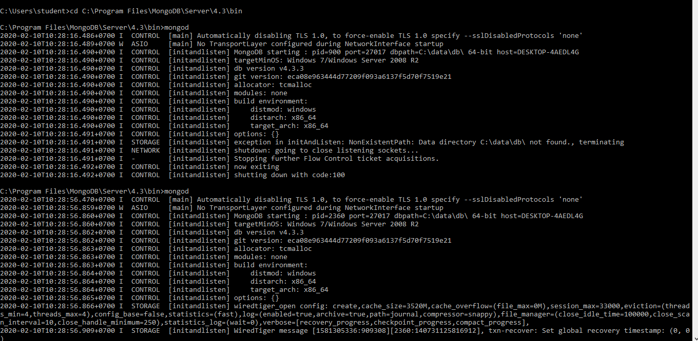
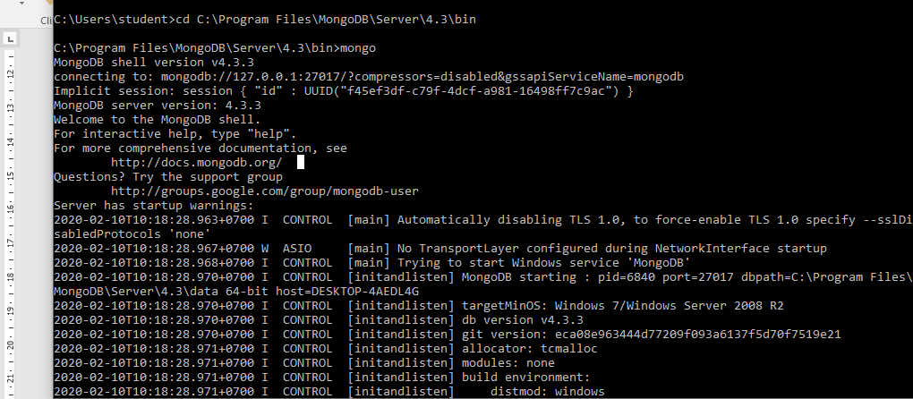

# tekn-basis-data
# mongoDB server
Cara mengaktifkan mongodb server adalah
buka cmd dan tuliskan perintah  cd <spasi> copy link mongodb lalu enter
dan tuliskan perintah “mongod” maka tampilan akan terlihat seperti dibawah ini

.
